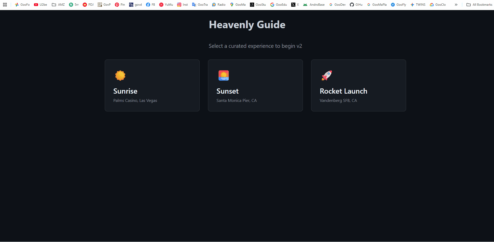

# Heavenly Guide - The Experience Dashboard PoC

**Core Mission:** To transform travel planning from a logistical task into an inspiring journey by making celestial events the main attraction. We are not selling hotel rooms; we are selling guaranteed, awe-inspiring experiences.

---

### ► [View the Live Demo Here](https://heavenly-guide-poc.onrender.com)

*(We recommend viewing the demo on a desktop for the best experience.)*



---

## About This Prototype

This repository contains a high-fidelity prototype that simulates the core user experience of "Heavenly Guide." This is not just a technical demo; it's a showcase of our product vision, demonstrating how we can turn complex astronomical data into a simple, emotional, and commercially viable product.

### Key Features Demonstrated:

*   **✨ Curated Experience Menu:** We've moved away from a complex map to an elegant, intuitive menu. This allows users to immediately choose a polished, story-driven experience.

*   **📊 Live Process Dashboard:** Upon selection, the user is presented with a dashboard where the "Process Log" animates in real-time. This "magic behind the curtain" builds anticipation and showcases the powerful engine at work.

*   **🗺️ Real Google Maps API Integration:** The final dashboard includes an interactive Google Map, proving our ability to integrate with essential, industry-standard third-party services to provide real-world location context.

*   **🏆 Gamification & Rewards:** Once the simulation is complete, the user is presented with a satisfying "Achievement Unlocked" award. This is a core part of our strategy to drive user engagement and retention.

*   **🔗 Dynamic "Book Now" Link:** The "Book on Google Hotels" button isn't static. It dynamically generates a search link for the specific location, demonstrating a clear and direct path to monetization and partner integration.

---

## Built With

*   **Frontend:** React.js, JavaScript (ES6+), HTML5, CSS3
*   **Libraries:**
    *   `@react-google-maps/api` - For seamless Google Maps integration.
    *   `suncalc` - For accurate astronomical calculations.
*   **Platforms:**
    *   GitHub - For version control.
    *   Render.com - For CI/CD and live deployment.

---

## What's Next for Heavenly Guide

This polished prototype is the validated foundation for our ambitious vision:

*   **Full 3D Globe Interface:** Evolving the experience into a cinematic, interactive 3D Earth.
*   **Real-Time Data APIs:** Integrating live data for rocket launches (e.g., The Space Devs API), meteor showers, and aurora forecasts.
*   **Direct Booking Integration:** Moving from a simple link to a full API integration with booking aggregators to create a seamless "Search-to-Book" user journey.

---

## How to Run Locally

1.  **Clone the Repository:**
    ```bash
    git clone https://github.com/aura-emowise/heavenly-guide-poc.git
    ```
2.  **Navigate to Directory:**
    ```bash
    cd heavenly-guide-poc
    ```
3.  **Install Dependencies:**
    ```bash
    npm install
    ```
4.  **Set Up Environment Variables:**
    *   Create a file named `.env` in the root of the project.
    *   Add your Google Maps API key to it like this:
        ```
        REACT_APP_GOOGLE_MAPS_API_KEY=YOUR_API_KEY_HERE
        ```
5.  **Run the Application:**
    ```bash
    npm start
    ```